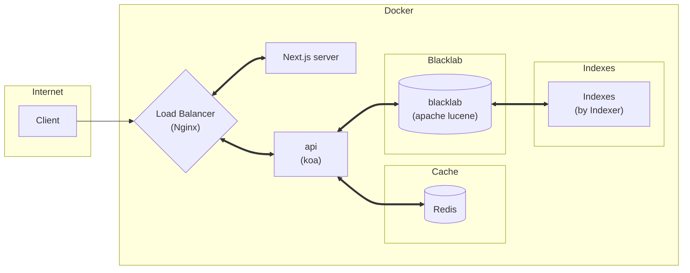

# **corpus-backend**

## **Overview of the Architecture**



The user only needs to put the tei files into `corpus-backend/blacklab/indexer/tei-data/` and it will be automatically written into the database by the pre-written script `indexer.sh` when running docker-compose.

> We assume here that you are familiar with the BlackLab indexing process; see [indexing with BlackLab](https://inl.github.io/BlackLab/indexing-with-blacklab.html) to learn more.

## **Setup**
### 1. Download the both frontend and backend projects: 
```bash
git clone git@github.com:Retr0327/corpus-frontend.git
git clone git@github.com:Retr0327/corpus-backend.git
```
Hence, the project strucutre should look like this: 

```
corpus-frontend\        
 |-- public\              # some static files
 |-- src\                 # source files
 |-- ...
corpus-backend\
 |-- deployment\          # deployment folder
 |-- src\                 # source files
 |-- ...
```

### 3. Environment variables:
For `corpus-frontend`, please create a `.env.local` file:

```bash
NEXT_PUBLIC_API_URL=http://localhost:3000/service/api/v1
NEXT_PUBLIC_EXTERNAL_API_URL=http://api:3000/service/api/v1
```

As for `corpus-backend`, please create a `.env` file: 

```bash
BLACKLAB_URL="http://blacklab:8080/blacklab-server"
```


### 4. Use docker to run:
 
- in development mode:
    ```bash
    docker-compose -f docker-compose.dev.yml up
    ```
- in production mode:
    ```bash
    docker-compose up
    ```
> Remember to run the command in the backend folder!


## Contact Me
If you have any suggestion or question, please do not hesitate to email me at r07142010@g.ntu.edu.tw


